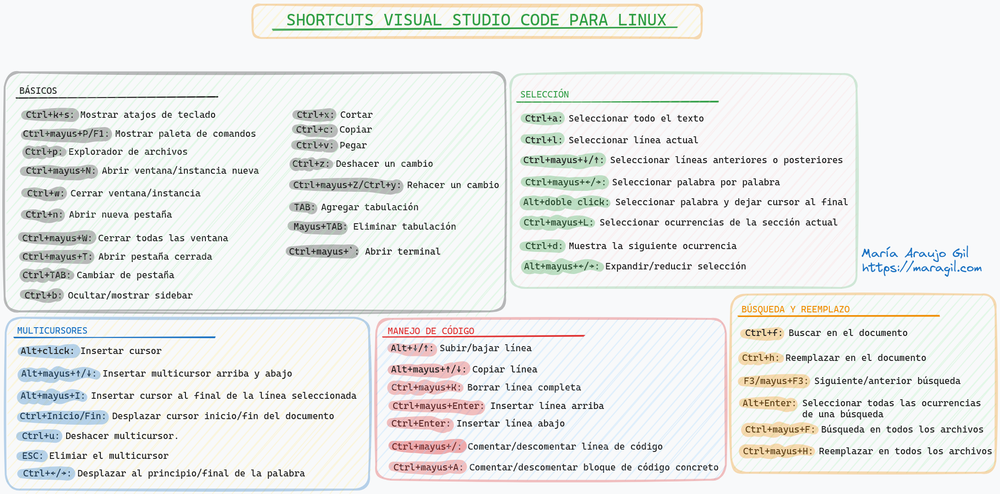

# ✂️ Shortcuts de Visual Studio Code para Linux

## 🟣 Objetivos

He creado esta guía con shortcuts de Visual Studio Code para Linux con los siguientes objetivos:

- Aumentar mi **eficiencia** y **productividad**, ya que me permiten ahorrar tiempo y esfuerzo al realizar tareas de manera más rápida y eficiente.
- **Acceder rápido** a distintas funciones y comandos específicos.
- Incrementar la **precisión** en la realización de tareas debido al uso de combinaciones de teclas en lugar de realizar movimientos con el ratón.

## 🟠 Contacto.
  
¡Espero que te haya gustado este proyecto! 💚

Puedes encontrar todos mis proyectos y aplicaciones web visitando mi porfolio: <https://www.maragil.com> 
